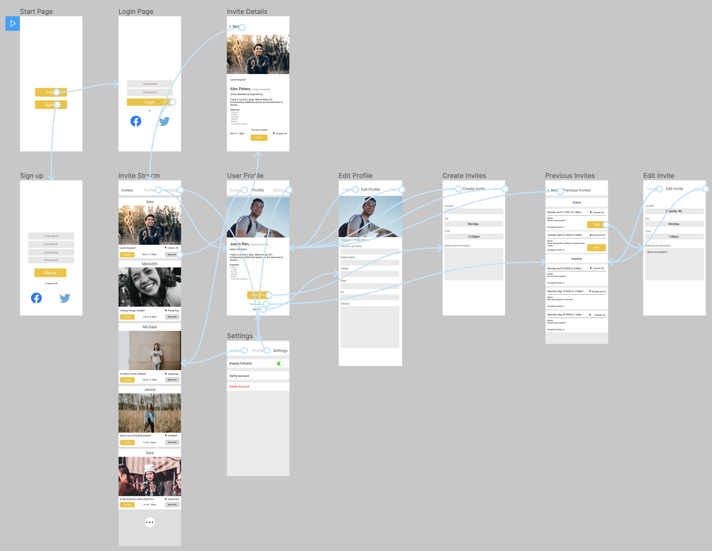

Original App Design Project - README Template
===

# MeetUp

## Table of Contents
1. [Overview](#Overview)
1. [Product Spec](#Product-Spec)
1. [Wireframes](#Wireframes)
2. [Schema](#Schema)

## Overview
### Description
MeetUp is an app that instantly connects you with people around you. Unlike Tinder and Bumble, which are mainly aimed at forming romantic relationships which makes people more reluctant to chat with others, MeetUp is about meeting someone new for a coffee, lunch, or even just exchanging talks about a subject that both users are interested in, all easily and with no hassle. The instantaneous aspect of MeetUp (to immediatly find someone to meet on the spot) is one of the app's important features, which are hard to provide in other geosocial networking applications.

### App Evaluation
- **Category:** Geosocial networking
- **Mobile:** The concept is most suitable to be applied on a mobile device, where one is able to use it instantly anywhere. The app relies on the idea that it is real-time and easy to access. Whenever you're bored you can instantly use it anywhere.
- **Story:** Getting to know new people and forming valuable connections might be hard to a fair amount of us, and quarantine season didn't help the cause at all since most of us were unable to go out or even get together with friends.
- **Market:** The market virtually includes everyone, but we believe that it is going to be most popular among teenagers and young adults, specifically college students. This group of people will use it to get to know new friends with common interests (maybe even introduce them to new exciting interests) and interesting personalities, allowing them to form new connections. The app will be helpful not only to social butterflies since it provides ease of access, but also to those who may struggle with initiating social connections since it provides a starting point for forming these connections. It also serves as a good starting point for people who just arrived at a new city/campus/etc to kickstart their social lives.
- **Habit:** The idea of how habit-forming this app is will depend on the users. Since it is easy to access immediately, people could use it everytime they are waiting outside for something, are just generally bored, or are actively trying to get to know new people. Additionally, people can use habitually for things like having a gym buddy or somebody to eat with.
- **Scope:** The app's idea is relativley simple and easy to implement. It would require sign in/up screens where you can also sign in/up with exisitng social media accounts, then it would provide a stream of MeetUp requests that would provide more details to the user about the inviter (Interests, where to meet up, etc...)

## Product Spec

### 1. User Stories (Required and Optional)

**Required Must-have Stories**

* User logs in to a stream of users who are available to meet up, along with their meet up location and time.
* Users can pick someone who’s already set up an invitation and accept it.
* Users can set up an invite with a location and idea of where they would like to meet up with people.
* Each invite will have a page with the meeting location and time.
* Every user will have a profile with their information.


**Optional Nice-to-have Stories**

* A quick ice breaker game to ease into the conversation 
* A Spotify/Apple playlist option
* An Instagram profile preview
* Messaging/chat


### 2. Screen Archetypes

* Login
* Signup 
    * Users are prompted to sign up after downloading the app. Access to the rest of the app is given after they successfully register. 
* Stream
    * A list of users who have an open invitation based on the nearby locations
* Profile Screen 
    * Allows the user to upload a profile photo.
    * Shows the user’s interests, and hobbies
* Setup Details
    * This is where the user sets up an invite. They add a max number of people who can accept the invite, location, date and time and special notes.
* Invite Details
    * Where a user can view the details of an invite and accept if interested 
* Edit Invite
    * Where the user can edit their invite, change time, location or close it.


### 3. Navigation

**Tab Navigation** (Tab to Screen)

* Invites(stream)
* Profile
* Settings

**Optional**
* Chat


**Flow Navigation** (Screen to Screen)

* Login Screen
  * Invite Stream
* Registration Screen
  * Invite Stream
* Invite Stream 
  * Invite Details, date time and location
* User Profile
  * Profile photo, user and hobbies as well as list of previous invites
* Set up invite
  * Invite set up screen
  * Invite Stream
* Settings
  * User profile


## Wireframes


### [BONUS] Digital Wireframes & Mockups

Link to [Figma Digital WireFrame](https://www.figma.com/file/ydklulrn1jUHDF9UGNPyGD/Meet-Up?node-id=0%3A1)

### [BONUS] Interactive Prototype

Link to the [Interactive Prototype](https://www.figma.com/proto/ydklulrn1jUHDF9UGNPyGD/Meet-Up?node-id=1%3A2&scaling=scale-down)

## Schema 
### Models
#### Users

   | Property      | Type     | Description |
   | ------------- | -------- | ------------|
   | Userid | Integer | Unique identifier across tables for each user |   
   | Username | String | Username to be used for identification in invites and login |
   | Password | String | Used for logging in |


 
### Networking
#### List of network requests by screen
   - Home Feed Screen
      - (Read/GET) Query all posts where user is author
         ```swift
         let query = PFQuery(className:"Post")
         query.whereKey("author", equalTo: currentUser)
         query.order(byDescending: "createdAt")
         query.findObjectsInBackground { (posts: [PFObject]?, error: Error?) in
            if let error = error { 
               print(error.localizedDescription)
            } else if let posts = posts {
               print("Successfully retrieved \(posts.count) posts.")
           // TODO: Do something with posts...
            }
         }
         ```
      
### Models
[Add table of models]
### Networking
- [Add list of network requests by screen ]
- [Create basic snippets for each Parse network request]
- [OPTIONAL: List endpoints if using existing API such as Yelp]
